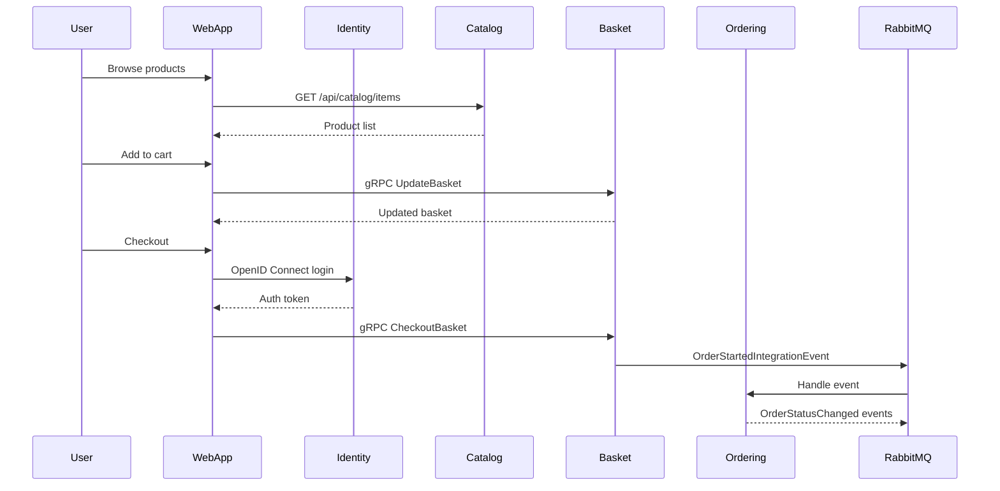
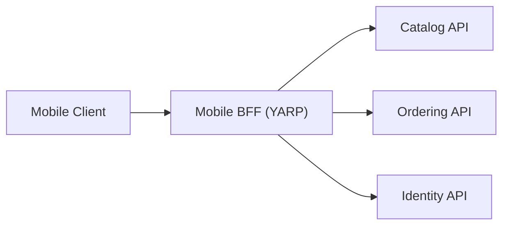
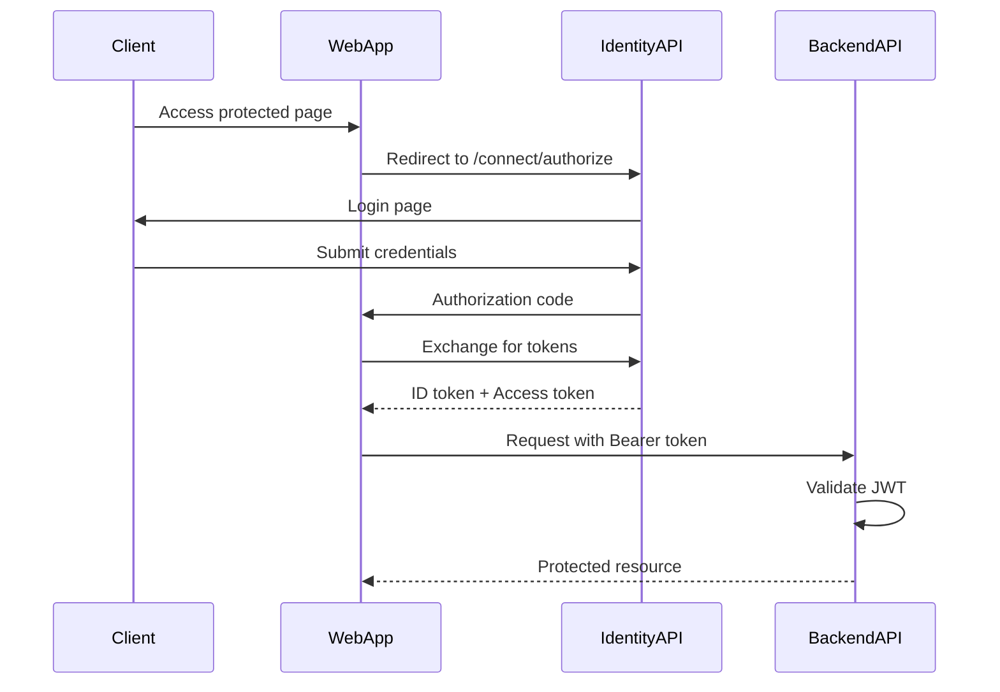

# API Architecture - eShop

> Last Updated: 2026-02-17

## Overview

eShop exposes multiple API styles: REST with API versioning for Catalog and Ordering, gRPC for Basket, and OAuth2/OpenID Connect for Identity. All APIs are orchestrated via .NET Aspire service discovery.

## API Catalog

### Catalog API (REST, Versioned)

Base path: `/api/catalog`

| Endpoint | Method | Version | Description |
|----------|--------|---------|-------------|
| `/items` | GET | v1, v2 | List paginated catalog items |
| `/items/by` | GET | v1, v2 | Batch get items by IDs |
| `/items/{id}` | GET | v1, v2 | Get single item |
| `/items/{id}/pic` | GET | v1, v2 | Get item picture |
| `/items/by/{name}` | GET | v1 | Search items by name |
| `/items/withsemanticrelevance/{text}` | GET | v1 | AI semantic search (path param) |
| `/items/withsemanticrelevance` | GET | v2 | AI semantic search (query param) |
| `/items/type/{typeId}/brand/{brandId?}` | GET | v1 | Filter by type and brand |
| `/items/type/all/brand/{brandId?}` | GET | v1 | Filter by brand only |
| `/catalogtypes` | GET | v1, v2 | List catalog types |
| `/catalogbrands` | GET | v1, v2 | List catalog brands |
| `/items` | PUT | v1, v2 | Update item |
| `/items` | POST | v1, v2 | Create item |
| `/items/{id}` | DELETE | v1, v2 | Delete item |

**Key Patterns:**
- Minimal API with endpoint route builder extensions
- API versioning via `Asp.Versioning.Http`
- OpenAPI documentation via `Microsoft.AspNetCore.OpenApi` + Scalar
- Pagination via `PaginationRequest` model
- pgvector semantic search for AI-powered queries

### Basket API (gRPC)

Protocol: gRPC (protobuf)
Proto file: `Basket.API/Proto/basket.proto`

| Service | Method | Description |
|---------|--------|-------------|
| BasketService | GetBasket | Retrieve customer basket |
| BasketService | UpdateBasket | Update basket contents |
| BasketService | DeleteBasket | Clear basket |
| BasketService | CheckoutBasket | Submit basket for ordering |

**Key Patterns:**
- gRPC service implementation (`BasketService`)
- Redis-backed repository (`IBasketRepository`)
- Publishes `OrderStartedIntegrationEvent` on checkout

### Ordering API (REST, CQRS)

Base path: `/api/orders` (with versioning)

| Endpoint | Method | Description |
|----------|--------|-------------|
| `/orders` | GET | List orders for authenticated user |
| `/orders/{orderId}` | GET | Get order details |
| `/orders` | POST | Create new order |
| `/orders/cancel` | PUT | Cancel order |
| `/orders/ship` | PUT | Ship order |
| `/orders/cardtypes` | GET | List card types |

**Key Patterns:**
- Commands routed via MediatR
- Read queries via Dapper (`OrderQueries`)
- Idempotent command handling (`IdentifiedCommand`)
- FluentValidation for request validation

### Identity API (OpenID Connect / OAuth2)

Protocol: OpenID Connect, OAuth2
Framework: Duende IdentityServer + ASP.NET Core Identity

| Flow | Description |
|------|-------------|
| Authorization Code + PKCE | Web app authentication |
| Client Credentials | Service-to-service auth |
| Device Code | Device authorization (webhooks) |

**Key Patterns:**
- MVC-based login/consent/logout views
- ASP.NET Core Identity for user management
- JWT Bearer tokens for API authorization

### Webhooks API (REST)

| Endpoint | Method | Description |
|----------|--------|-------------|
| Subscribe | POST | Register webhook subscription |
| Unsubscribe | DELETE | Remove subscription |
| List | GET | List subscriptions |

## API Communication Flow

## Mobile BFF

The Mobile BFF uses YARP reverse proxy to aggregate multiple backend APIs behind a single endpoint for mobile clients.

## Authentication Flow

