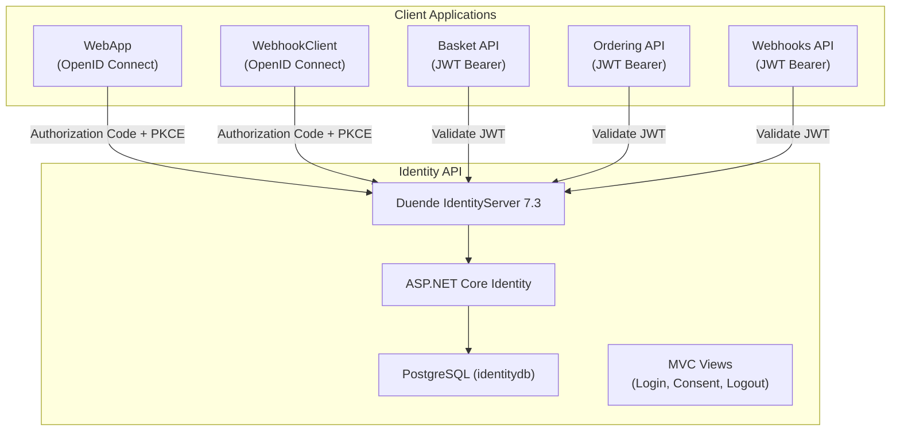
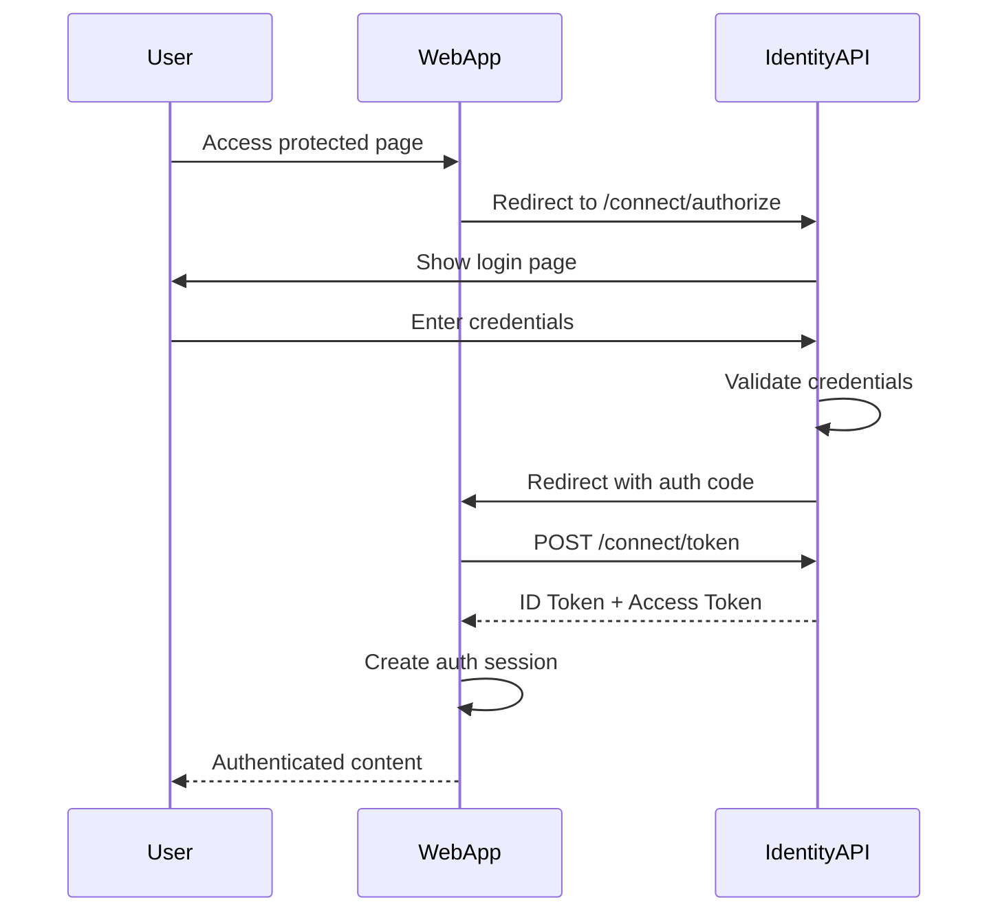
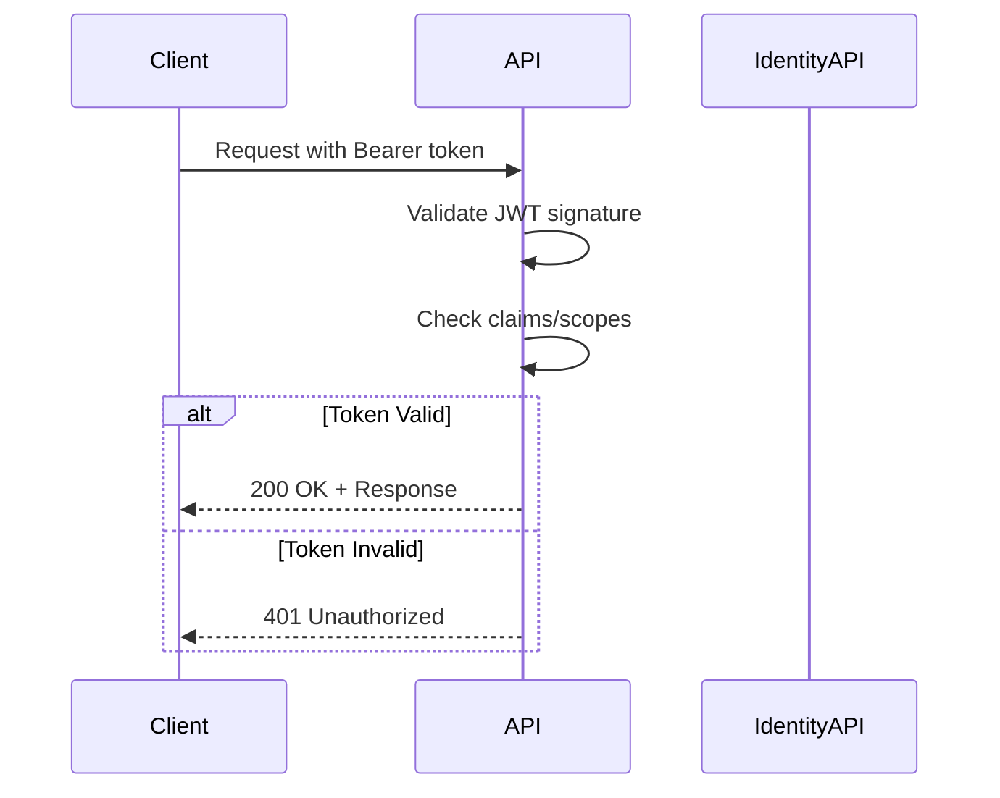

# Authentication & Authorization Architecture - eShop

> Last Updated: 2026-02-17

## Overview

eShop uses Duende IdentityServer as a centralized identity provider, implementing OpenID Connect and OAuth2 protocols. ASP.NET Core Identity manages user accounts, and JWT Bearer tokens secure API endpoints.

## Identity Architecture

## Authentication Flows

### Web Application (OpenID Connect)

### API Authorization (JWT Bearer)

## Registered Clients

The Identity API maintains callback URLs for all client applications:

| Client | Type | Callback URLs |
|--------|------|---------------|
| WebApp | Web Application | Self-referencing endpoint |
| WebhookClient | Web Application | Self-referencing endpoint |
| Basket API | API Resource | HTTP endpoint |
| Ordering API | API Resource | HTTP endpoint |
| Webhooks API | API Resource | HTTP endpoint |

## Identity Configuration

- **Token Signing:** Temporary development key (`tempkey.jwk`) — not for production use
- **User Management:** ASP.NET Core Identity with EF Core PostgreSQL store
- **User Secrets:** Configured for development environment
- **Views:** Server-rendered MVC views for login, consent, logout, device authorization, and diagnostics

## Security Considerations

- JWT Bearer tokens used for service-to-service authentication
- OpenID Connect with PKCE for web application authentication
- Identity URL passed via environment variables for service discovery
- Cyclic references between Identity API and client apps handled via Aspire environment configuration
