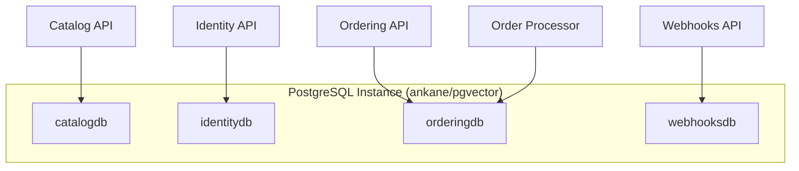
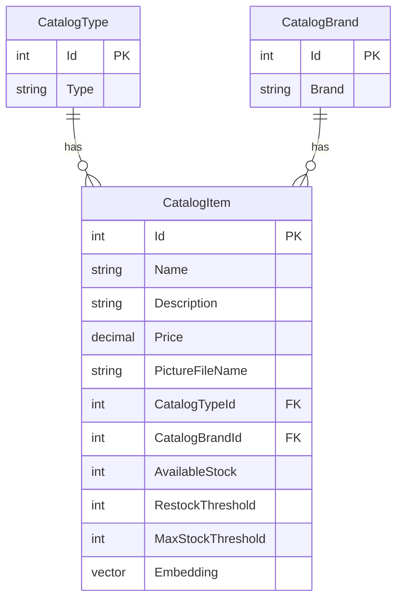
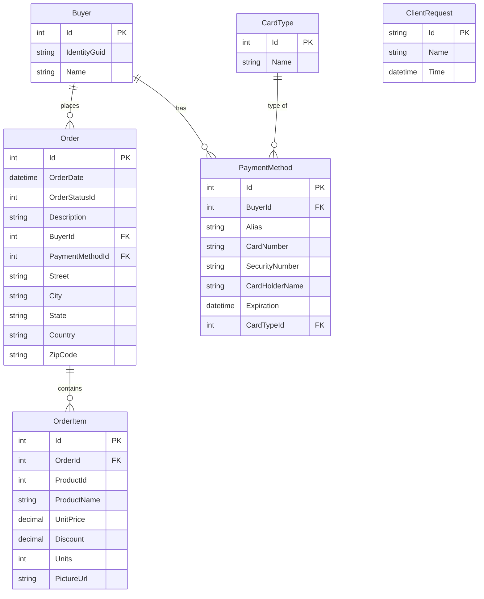
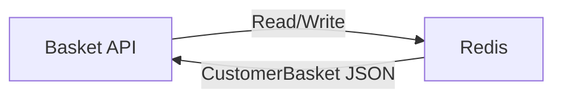

# Database Architecture - eShop

> Last Updated: 2026-02-17

## Overview

eShop uses PostgreSQL as its primary relational database with the pgvector extension for AI-powered semantic search. Each bounded context owns its own logical database within a shared PostgreSQL instance.

## Database Topology

## Database Schemas

### catalogdb — Catalog Database

Stores product catalog data including items, brands, types, and vector embeddings for semantic search.

**Key Features:**
- pgvector `Embedding` column on `CatalogItem` for AI semantic search
- Stock management fields for inventory tracking
- EF Core with Npgsql provider

### identitydb — Identity Database

Managed by Duende IdentityServer and ASP.NET Core Identity. Stores users, roles, claims, and IdentityServer operational/configuration data.

**Tables (managed by frameworks):**
- ASP.NET Core Identity: `AspNetUsers`, `AspNetRoles`, `AspNetUserClaims`, `AspNetUserRoles`, etc.
- Duende IdentityServer: `Clients`, `ApiResources`, `ApiScopes`, `PersistedGrants`, etc.

### orderingdb — Ordering Database

Implements DDD patterns with a dedicated `ordering` schema. Uses EF Core with explicit entity configurations.

**Schema:** `ordering`
**Entity Configurations (Fluent API):**
- `OrderEntityTypeConfiguration`
- `OrderItemEntityTypeConfiguration`
- `BuyerEntityTypeConfiguration`
- `PaymentMethodEntityTypeConfiguration`
- `CardTypeEntityTypeConfiguration`
- `ClientRequestEntityTypeConfiguration` (idempotency)

**Integration Event Log:** Uses `IntegrationEventLogEF` for durable event publishing via `UseIntegrationEventLogs()`.

### webhooksdb — Webhooks Database

Stores webhook subscriptions and delivery records.

## Cache Layer — Redis

- **Purpose:** Stores shopping baskets as serialized `CustomerBasket` objects
- **Key Pattern:** Customer/buyer ID as key
- **Model:** `CustomerBasket` → `List<BasketItem>`
- **Persistence:** Non-persistent (cache-only, session lifetime)

## Data Access Patterns

| Service | ORM | Pattern |
|---------|-----|---------|
| Catalog API | EF Core (Npgsql) | DbContext direct queries + pgvector |
| Ordering API | EF Core (Npgsql) | Repository pattern + Unit of Work |
| Ordering Queries | Dapper | Lightweight read-model queries |
| Identity API | EF Core (Npgsql) | ASP.NET Core Identity + IdentityServer |
| Basket API | StackExchange.Redis | Key-value serialization |
| Webhooks API | EF Core (Npgsql) | DbContext |

## Migration Strategy

- **Tool:** `dotnet ef migrations`
- **Location:** `Ordering.Infrastructure/Migrations/`
- **Command:** `dotnet ef migrations add --startup-project Ordering.API --context OrderingContext [migration-name]`
- **Catalog:** Seed data loaded from JSON files (`Setup/` folder)
