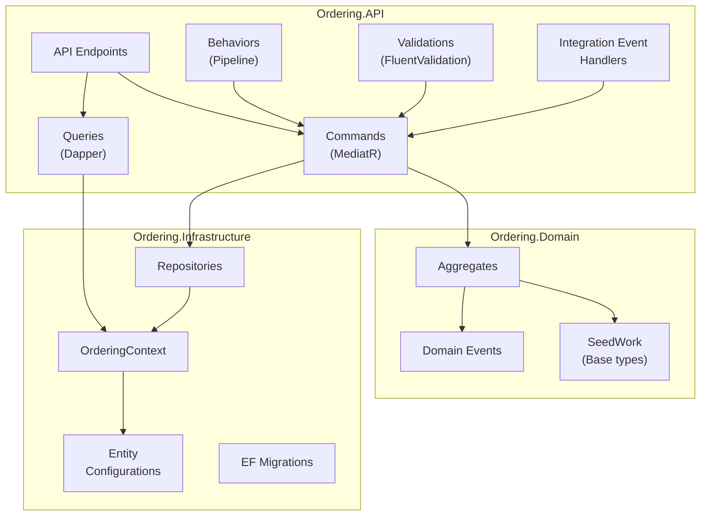
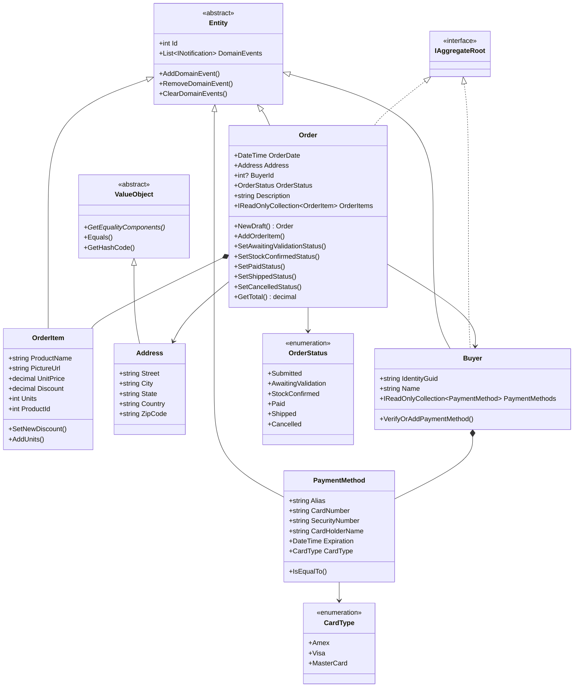
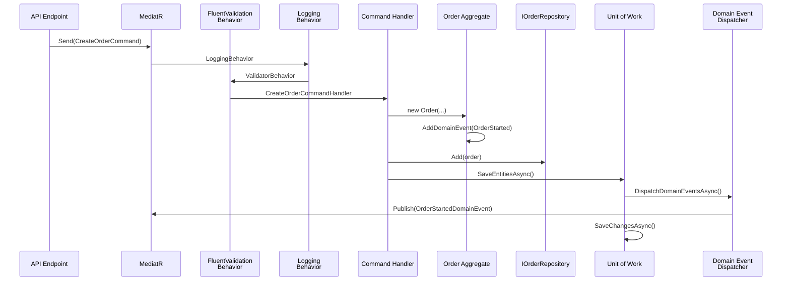
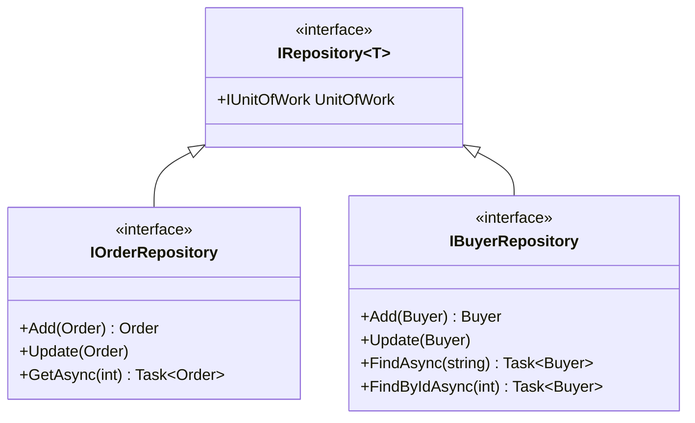

# Domain-Driven Design & CQRS Patterns - eShop

> Last Updated: 2026-02-17

## Overview

The Ordering bounded context is the primary DDD implementation in eShop. It demonstrates aggregates, value objects, domain events, repositories, and CQRS with MediatR. Other services (Catalog, Basket) use simpler patterns appropriate to their complexity.

## Ordering Bounded Context

### Layer Architecture

### Aggregate Design

### Domain Events

Domain events are raised by aggregates and dispatched by the `MediatorExtension` before saving changes to the database.

| Event | Raised By | Purpose |
|-------|-----------|---------|
| `OrderStartedDomainEvent` | Order (constructor) | Triggers buyer/payment verification |
| `OrderCancelledDomainEvent` | `SetCancelledStatus()` | Notifies of cancellation |
| `OrderShippedDomainEvent` | `SetShippedStatus()` | Notifies of shipment |
| `OrderStatusChangedToAwaitingValidationDomainEvent` | `SetAwaitingValidationStatus()` | Triggers stock validation |
| `OrderStatusChangedToStockConfirmedDomainEvent` | `SetStockConfirmedStatus()` | Stock confirmed |
| `OrderStatusChangedToPaidDomainEvent` | `SetPaidStatus()` | Payment confirmed |
| `BuyerPaymentMethodVerifiedDomainEvent` | Buyer aggregate | Payment method validated |

### CQRS Command Flow

### Commands

| Command | Handler | Description |
|---------|---------|-------------|
| `CreateOrderCommand` | `CreateOrderCommandHandler` | Create new order from basket checkout |
| `CancelOrderCommand` | `CancelOrderCommandHandler` | Cancel an existing order |
| `ShipOrderCommand` | `ShipOrderCommandHandler` | Mark order as shipped |
| `SetAwaitingValidationOrderStatusCommand` | Handler | Transition to awaiting validation |
| `SetStockConfirmedOrderStatusCommand` | Handler | Confirm stock availability |
| `SetStockRejectedOrderStatusCommand` | Handler | Reject due to insufficient stock |
| `SetPaidOrderStatusCommand` | Handler | Mark order as paid |
| `CreateOrderDraftCommand` | `CreateOrderDraftCommandHandler` | Create draft order (preview) |
| `IdentifiedCommand<T>` | `IdentifiedCommandHandler<T>` | Idempotent command wrapper |

### Read Queries (Dapper)

Queries bypass the domain model and read directly from the database using Dapper for performance.

- `OrderQueries` implements `IOrderQueries`
- Returns `OrderViewModel` DTOs
- Used for listing orders and order details

## SeedWork Base Types

| Type | Purpose |
|------|---------|
| `Entity` | Base class with ID, domain event collection |
| `IAggregateRoot` | Marker interface for aggregate roots |
| `IRepository<T>` | Generic repository interface |
| `IUnitOfWork` | Unit of Work abstraction (`SaveEntitiesAsync`) |
| `ValueObject` | Base class for value objects with equality by components |

## Repository Pattern

Repositories are implemented in `Ordering.Infrastructure/Repositories/` and inject `OrderingContext` for data access.
