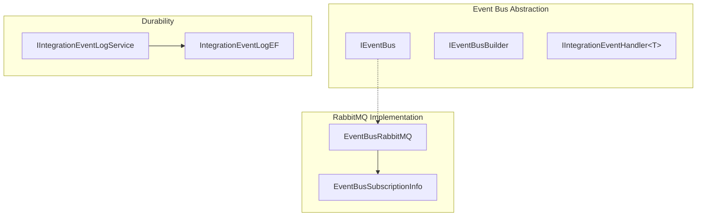
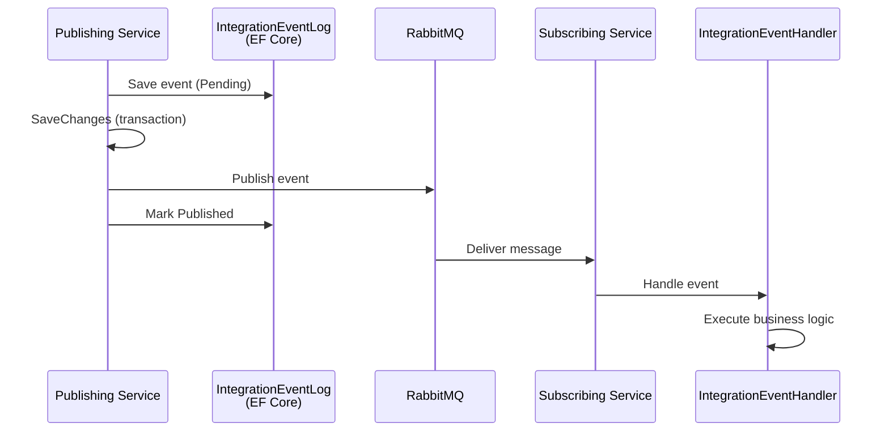
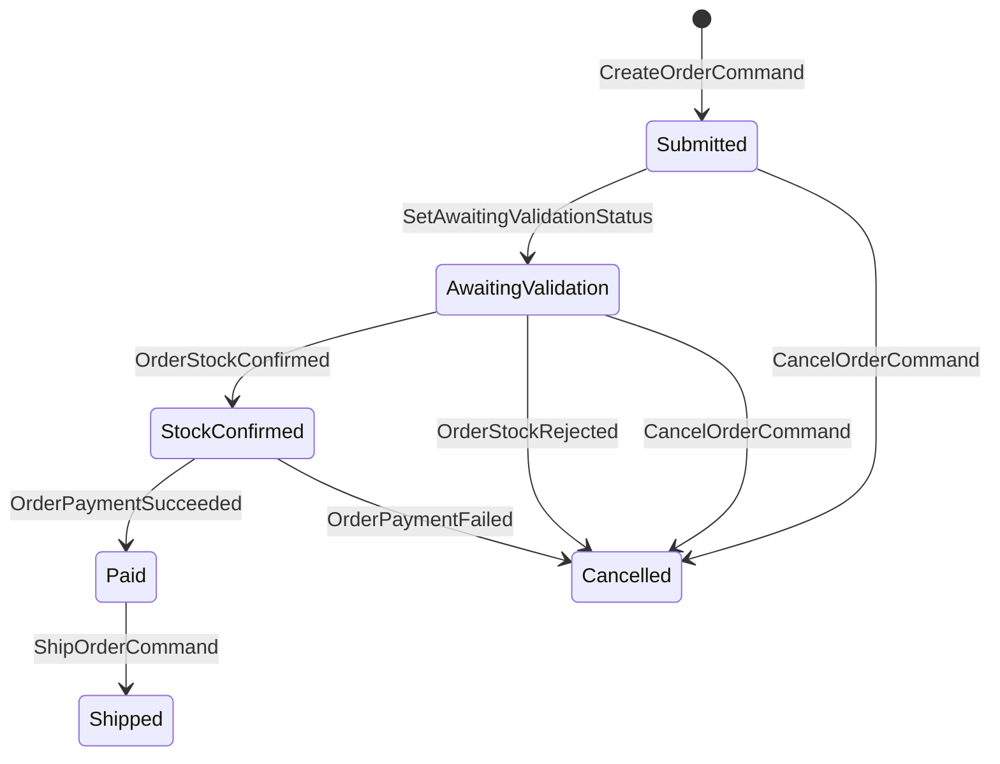
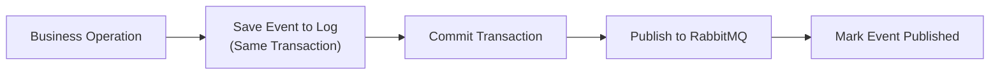

# Event-Driven Architecture - eShop

> Last Updated: 2026-02-17

## Overview

eShop uses an event-driven architecture for asynchronous communication between microservices. Integration events flow through RabbitMQ, enabling eventual consistency across bounded contexts. Domain events are used within the Ordering service for intra-aggregate coordination.

## Event Bus Architecture

## Integration Event Flow

## Key Integration Events

### Catalog Events
| Event | Publisher | Subscribers | Purpose |
|-------|----------|-------------|---------|
| `ProductPriceChangedIntegrationEvent` | Catalog API | Basket API | Notify price changes |
| `OrderStockConfirmedIntegrationEvent` | Catalog API | Ordering API | Confirm stock availability |
| `OrderStockRejectedIntegrationEvent` | Catalog API | Ordering API | Reject insufficient stock |

### Ordering Events
| Event | Publisher | Subscribers | Purpose |
|-------|----------|-------------|---------|
| `OrderStartedIntegrationEvent` | Basket API | Ordering API | Initiate order creation |
| `OrderStatusChangedToAwaitingValidationIntegrationEvent` | Ordering API | Catalog API | Request stock validation |
| `OrderStatusChangedToPaidIntegrationEvent` | Ordering API | Catalog API | Deduct stock on payment |
| `OrderStatusChangedToSubmittedIntegrationEvent` | Ordering API | Webhooks API | Notify order submitted |
| `OrderStatusChangedToShippedIntegrationEvent` | Ordering API | Webhooks API | Notify order shipped |
| `OrderStatusChangedToCancelledIntegrationEvent` | Ordering API | Webhooks API | Notify order cancelled |

### Payment Events
| Event | Publisher | Subscribers | Purpose |
|-------|----------|-------------|---------|
| `OrderPaymentSucceededIntegrationEvent` | Payment Processor | Ordering API | Payment confirmed |
| `OrderPaymentFailedIntegrationEvent` | Payment Processor | Ordering API | Payment failed |

## Order State Machine

## Event Durability

The `IntegrationEventLogEF` library provides transactional outbox-style durability:

1. Integration events are saved to the `IntegrationEventLog` table within the same database transaction as the business operation
2. After the transaction commits, events are published to RabbitMQ
3. Events are marked as "Published" after successful delivery
4. Failed events can be retried

## Domain Events vs Integration Events

| Aspect | Domain Events | Integration Events |
|--------|--------------|-------------------|
| **Scope** | Within a bounded context | Across services |
| **Transport** | MediatR (in-process) | RabbitMQ (out-of-process) |
| **Consistency** | Strong (same transaction) | Eventual |
| **Durability** | In-memory | Persisted in IntegrationEventLog |
| **Example** | `OrderStartedDomainEvent` | `OrderStatusChangedToSubmittedIntegrationEvent` |
