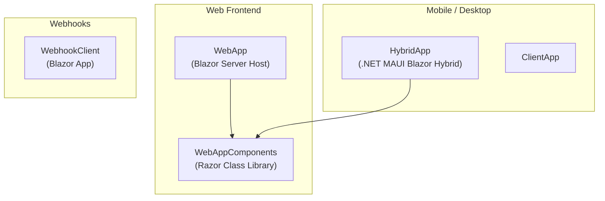
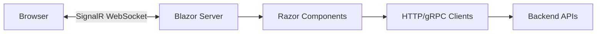

# Frontend Architecture - eShop

> Last Updated: 2026-02-17

## Overview

eShop's primary frontend is a Blazor Server application with Interactive Server rendering. The UI is split into two projects: `WebApp` (the host) and `WebAppComponents` (shared Razor component library). Optional clients include a .NET MAUI Hybrid app and a standalone client app.

## Frontend Projects



## WebApp Structure

```
WebApp/
├── Components/
│   ├── App.razor              # Root component
│   ├── Routes.razor           # Router configuration
│   ├── _Imports.razor         # Global usings
│   ├── Chatbot/               # AI chatbot components
│   ├── Layout/                # Layout components
│   └── Pages/
│       ├── Cart/              # Shopping cart pages
│       ├── Catalog/           # Product browsing pages
│       ├── Checkout/          # Checkout flow pages
│       ├── Item/              # Product detail pages
│       └── User/              # User profile pages
├── Extensions/                # Service registration
├── Services/                  # Backend service clients
├── wwwroot/                   # Static assets (CSS, images)
└── Program.cs                 # App configuration & startup
```

## WebAppComponents Structure

Shared component library reusable across WebApp and HybridApp:

```
WebAppComponents/
├── Catalog/                   # Catalog browsing components
├── Item/                      # Product item display components
├── Services/                  # Shared service interfaces
└── _Imports.razor             # Component-level usings
```

## Rendering Model



- **Render Mode:** Interactive Server (SignalR-based)
- **Static Files:** Served via `UseStaticFiles()` middleware
- **HTTPS:** Enforced in non-development environments
- **Antiforgery:** Enabled via `UseAntiforgery()`

## Key Pages

| Page | Path | Description |
|------|------|-------------|
| Catalog | `/` | Product listing with filtering by type/brand |
| Item Detail | `/item/{id}` | Product details with add-to-cart |
| Cart | `/cart` | Shopping cart management |
| Checkout | `/checkout` | Order submission |
| User Profile | `/user` | Order history, account details |

## Service Communication

The WebApp communicates with backend services using:

| Backend | Protocol | Client |
|---------|----------|--------|
| Catalog API | HTTP REST | HttpClient with service discovery |
| Basket API | gRPC | Generated gRPC client (from `basket.proto`) |
| Ordering API | HTTP REST | HttpClient with service discovery |
| Identity API | OpenID Connect | OIDC middleware |
| RabbitMQ | AMQP | EventBus for integration events |

## Image Proxying

Product images are served through the WebApp using YARP's `MapForwarder`:

```
/product-images/{id} → catalog-api/api/catalog/items/{id}/pic
```

This avoids direct client-to-API calls for image serving.

## AI Chatbot (Optional)

The `Chatbot/` directory contains components for an AI-powered product search assistant:
- Integrates with Azure OpenAI or local Ollama
- Provides natural language product search
- Embedded in the WebApp layout
