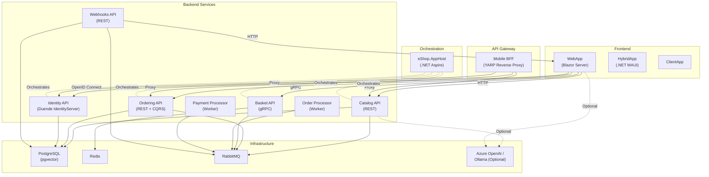

# System Architecture Overview - eShop

> Last Updated: 2026-02-17

## High-Level Architecture

eShop follows a microservices architecture orchestrated by .NET Aspire. Services communicate via REST APIs, gRPC, and asynchronous integration events through RabbitMQ.

## Service Responsibilities

| Service | Responsibility | Communication |
|---------|---------------|---------------|
| **Catalog API** | Product catalog CRUD, search, image serving | REST (versioned v1/v2) |
| **Basket API** | Shopping cart management per customer | gRPC |
| **Ordering API** | Order lifecycle, DDD aggregates, CQRS | REST + MediatR |
| **Identity API** | Authentication, authorization, user management | OpenID Connect / OAuth2 |
| **Webhooks API** | Event subscription and notification dispatch | REST + RabbitMQ |
| **Order Processor** | Background order state machine processing | RabbitMQ consumer |
| **Payment Processor** | Payment validation and confirmation | RabbitMQ consumer |
| **WebApp** | E-commerce storefront UI | Blazor Server |
| **Mobile BFF** | Mobile API gateway | YARP reverse proxy |

## Shared Libraries

| Library | Purpose |
|---------|---------|
| **eShop.ServiceDefaults** | OpenTelemetry, health checks, service discovery configuration |
| **EventBus** | Integration event abstractions (`IEventBus`, `IIntegrationEventHandler`) |
| **EventBusRabbitMQ** | RabbitMQ-based event bus implementation |
| **IntegrationEventLogEF** | EF Core-based durability for integration events |
| **WebAppComponents** | Shared Blazor/Razor UI components |
| **Ordering.Domain** | DDD entities, aggregates, value objects, domain events |
| **Ordering.Infrastructure** | EF Core context, repositories, entity configurations |

## Cross-Cutting Concerns

- **Service Discovery:** Microsoft.Extensions.ServiceDiscovery via .NET Aspire
- **Observability:** OpenTelemetry (traces, metrics, logs) exported via OTLP
- **Health Checks:** Standard ASP.NET Core health endpoints (`/health`, `/alive`)
- **Resilience:** Microsoft.Extensions.Http.Resilience for HTTP client policies
- **API Documentation:** OpenAPI specs + Scalar UI
