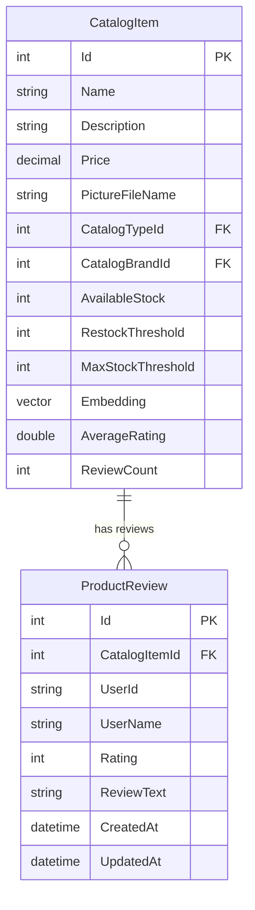

# Database Schema

This is the database schema implementation for the spec detailed in [spec.md](../spec.md)

> Created: 2026-02-17
> Version: 1.0.0

## Overview

This spec adds a new `product_reviews` table to the existing `catalogdb` PostgreSQL database and adds two denormalized columns to the existing `catalog` table for `CatalogItem`. All changes are managed via EF Core migrations within the Catalog.API project.

## New Table: `product_reviews`

### Schema Definition

```sql
CREATE TABLE product_reviews (
  id              SERIAL       PRIMARY KEY,
  catalog_item_id INTEGER      NOT NULL REFERENCES catalog (id) ON DELETE CASCADE,
  user_id         VARCHAR(256) NOT NULL,
  user_name       VARCHAR(256) NOT NULL,
  rating          INTEGER      NOT NULL CHECK (rating >= 1 AND rating <= 5),
  review_text     VARCHAR(2000),
  created_at      TIMESTAMP WITH TIME ZONE NOT NULL DEFAULT NOW(),
  updated_at      TIMESTAMP WITH TIME ZONE NOT NULL DEFAULT NOW(),

  CONSTRAINT uq_product_reviews_user_item UNIQUE (catalog_item_id, user_id)
);
```

### Columns

| Column | Type | Nullable | Description |
|--------|------|----------|-------------|
| `id` | `SERIAL` (int) | No | Auto-increment primary key |
| `catalog_item_id` | `INTEGER` | No | FK to `CatalogItem.Id` |
| `user_id` | `VARCHAR(256)` | No | Identity user ID (from JWT `sub` claim) |
| `user_name` | `VARCHAR(256)` | No | Display name (from JWT `name` claim) |
| `rating` | `INTEGER` | No | Star rating, constrained 1–5 |
| `review_text` | `VARCHAR(2000)` | Yes | Optional full-text review |
| `created_at` | `TIMESTAMPTZ` | No | When the review was first created |
| `updated_at` | `TIMESTAMPTZ` | No | When the review was last updated (upsert) |

### Indexes

```sql
-- Primary key index (automatic)
-- Unique constraint index (automatic from UNIQUE constraint)

-- For efficient "recent reviews" queries: GET reviews by item, ordered by newest
CREATE INDEX ix_product_reviews_item_created
  ON product_reviews (catalog_item_id, created_at DESC);
```

### Constraints

- **Primary Key:** `id`
- **Foreign Key:** `catalog_item_id` → `CatalogItem.Id` (CASCADE delete — if a product is removed, its reviews are removed)
- **Unique:** `(catalog_item_id, user_id)` — enforces one review per user per product
- **Check:** `rating >= 1 AND rating <= 5`

## Modified Table: `catalog` (CatalogItem)

### New Columns

```sql
ALTER TABLE catalog
  ADD COLUMN average_rating DOUBLE PRECISION NOT NULL DEFAULT 0,
  ADD COLUMN review_count   INTEGER          NOT NULL DEFAULT 0;
```

| Column | Type | Nullable | Default | Description |
|--------|------|----------|---------|-------------|
| `average_rating` | `DOUBLE PRECISION` | No | 0 | Denormalized average star rating across all reviews |
| `review_count` | `INTEGER` | No | 0 | Denormalized total number of reviews |

### Rationale for Denormalization

- Avoids expensive `JOIN` + `AVG()` + `COUNT()` on every catalog listing query
- Updated transactionally when a review is created/updated
- Acceptable trade-off: slight write overhead in exchange for fast read performance on high-traffic listing pages

## Entity Relationship Diagram



## EF Core Entity Configuration

### ProductReview Entity

```csharp
// New file: Catalog.API/Infrastructure/EntityConfigurations/ProductReviewEntityTypeConfiguration.cs

public class ProductReviewEntityTypeConfiguration : IEntityTypeConfiguration<ProductReview>
{
    public void Configure(EntityTypeBuilder<ProductReview> builder)
    {
        builder.ToTable("product_reviews");

        builder.HasKey(r => r.Id);

        builder.Property(r => r.CatalogItemId)
            .IsRequired();

        builder.Property(r => r.UserId)
            .IsRequired()
            .HasMaxLength(256);

        builder.Property(r => r.UserName)
            .IsRequired()
            .HasMaxLength(256);

        builder.Property(r => r.Rating)
            .IsRequired();

        builder.Property(r => r.ReviewText)
            .HasMaxLength(2000);

        builder.Property(r => r.CreatedAt)
            .IsRequired();

        builder.Property(r => r.UpdatedAt)
            .IsRequired();

        // One review per user per product
        builder.HasIndex(r => new { r.CatalogItemId, r.UserId })
            .IsUnique();

        // Efficient recent reviews query
        builder.HasIndex(r => new { r.CatalogItemId, r.CreatedAt })
            .IsDescending(false, true);

        // Foreign key relationship
        builder.HasOne<CatalogItem>()
            .WithMany()
            .HasForeignKey(r => r.CatalogItemId)
            .OnDelete(DeleteBehavior.Cascade);
    }
}
```

### CatalogItem Entity Modifications

Add to existing `CatalogItemEntityTypeConfiguration`:

```csharp
builder.Property(ci => ci.AverageRating)
    .HasDefaultValue(0d);

builder.Property(ci => ci.ReviewCount)
    .HasDefaultValue(0);
```

## Migration

### Migration Command

```bash
cd src/Catalog.API
dotnet ef migrations add AddProductReviews --context CatalogContext
```

### Migration Steps

1. Create `product_reviews` table with all columns, constraints, and indexes
2. Add `average_rating` (double, default 0) and `review_count` (int, default 0) columns to existing `catalog` table
3. All existing catalog items will have `average_rating = 0` and `review_count = 0`

### Rollback

```bash
dotnet ef migrations remove --context CatalogContext
```

## Data Integrity Rules

- Reviews are cascade-deleted when the parent `CatalogItem` is deleted
- `AverageRating` and `ReviewCount` on `CatalogItem` are recalculated from actual review data when a review is submitted (upsert)
- The recalculation uses a database query (`AVG`, `COUNT`) to ensure accuracy rather than incremental math
- `UpdatedAt` is set on every upsert to track when reviews were last modified
