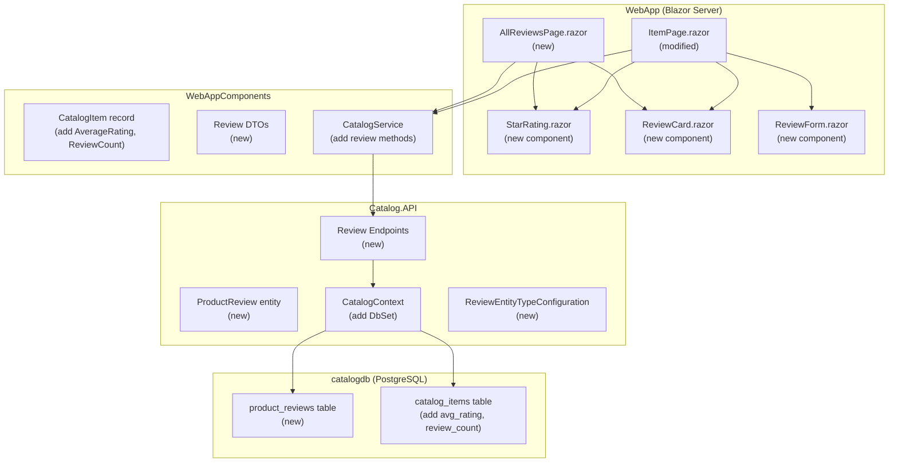
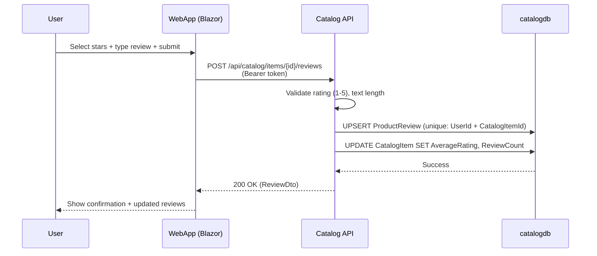
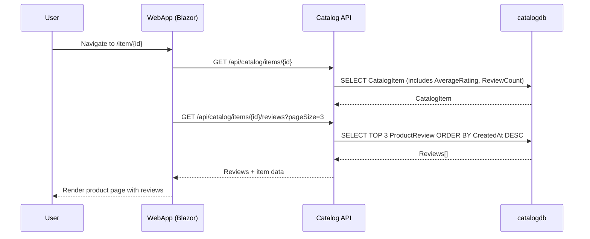

# Technical Specification

This is the technical specification for the spec detailed in [spec.md](./spec.md)

> Created: 2026-02-17
> Version: 1.0.0

## Technical Requirements

### Functional Requirements

- Authenticated users can submit a star rating (1–5) and optional text review for any catalog product
- One review per user per product; resubmitting replaces the previous review
- Product detail page (`/item/{id}`) displays average rating, total review count, and the 3 most recent reviews
- "See all ratings and reviews" link navigates to `/item/{id}/reviews` — a paginated page (10 per page, newest first)
- Catalog listing product cards display average star rating and review count
- Review text has a maximum length of 2000 characters
- Anonymous (unauthenticated) users can view reviews but cannot submit them

### Non-Functional Requirements

- Review submission and retrieval should respond within 200ms under normal load
- Average rating on catalog listings should not degrade listing query performance (denormalized)
- Review data stored in PostgreSQL `catalogdb` alongside existing catalog entities

### UI/UX Specifications

#### Star Rating Display Component
- Visual 5-star display using filled/empty/half-star SVG icons
- Shows numeric average (e.g., "4.2") and review count (e.g., "(47 reviews)")
- Used on both product cards (compact) and product detail page (full size)

#### Review Submission Form (Product Detail Page)
- Star selector: 5 clickable stars for rating selection (required)
- Text area: Optional review text, max 2000 characters, with character counter
- Submit button: Disabled until star rating is selected
- Only visible to authenticated users
- Shows "Update your review" if user has existing review, pre-populated with previous values

#### Recent Reviews Section (Product Detail Page)
- Displayed below product details, above the review submission form
- Shows: User display name, star rating, review text (truncated if long), date
- Maximum 3 reviews shown
- "See all ratings and reviews →" link at bottom

#### All Reviews Page (`/item/{id}/reviews`)
- Page header: Product name + average rating summary
- Paginated list: 10 reviews per page
- Each review: User display name, star rating, review text, date
- Pagination controls at bottom
- Default sort: newest first

### Integration Requirements

- Extends existing Catalog.API with new review endpoints
- Uses existing CatalogContext (EF Core + Npgsql) with new DbSet
- Uses existing Identity/authentication infrastructure (JWT Bearer on API, OpenID Connect on WebApp)
- No new integration events needed for initial implementation (reviews are synchronous CRUD)

## Architecture

### Component Architecture

### Data Flow — Submit Review

### Data Flow — View Reviews

## Approach Options

### Option A: Separate Reviews Microservice

- **Pros:** Clean bounded context separation, independent scaling, aligns with original roadmap mention
- **Cons:** Requires new project, Aspire wiring, cross-service queries for catalog listings, eventual consistency for average ratings

### Option B: Extend Catalog.API (Selected)

- **Pros:** Simpler implementation, reviews live alongside catalog data in catalogdb, single database transaction for denormalized averages, no cross-service latency, consistent with user requirement
- **Cons:** Catalog API takes on additional responsibility, slightly less separation of concerns

**Rationale:** The user explicitly requested storage in catalogdb. Reviews are tightly coupled to catalog items — they reference items by ID and are displayed on catalog pages. The denormalized average rating on `CatalogItem` ensures listing queries remain performant without cross-service aggregation. This approach avoids the complexity of a new microservice for what is fundamentally catalog-adjacent data.

## External Dependencies

No new external libraries required. The feature uses existing dependencies:

- **Entity Framework Core (Npgsql)** — Already in use for CatalogContext
- **ASP.NET Core Authentication** — Already configured for JWT Bearer
- **Blazor Server Components** — Already in use for WebApp

## Performance Considerations

- **Denormalized `AverageRating` and `ReviewCount`** on `CatalogItem` avoids JOIN/aggregation queries on every catalog listing request
- **Composite unique index** on `(CatalogItemId, UserId)` ensures fast upsert lookup and enforces one-review-per-user constraint
- **Index on `(CatalogItemId, CreatedAt DESC)`** for efficient "recent reviews" and paginated queries
- **No N+1 queries** — review data fetched via dedicated endpoint, not embedded in catalog listing response (average rating is denormalized)
